<h1 align="center">Hi 👋, I'm Radhika Kapoor</h1>

  

  
  
  

  

---

## 👩‍💻 About Me

- 🎓 Final-year Computer Science student at **Sukkur IBA University**
- 🧠 Exploring **AI/ML** and **Frontend Development**
- 💼 Frontend/Full-Stack intern at **Webiators** (Jan–Jun 2026)
- 🌱 Turning data and interfaces into meaningful, usable products
- ⚡ Driven by curiosity and continuous learning

---

## 🔭 Currently

- 🧩 Grinding **DSA in Java** — arrays to graphs to dynamic programming
- 🤖 Building applied ML projects and exploring RAG pipelines
- 🎨 Designing at the intersection of AI and frontend interfaces
- 📬 Open to **AI/ML** and **Frontend Developer** internship opportunities

---

## 🏆 Highlights

- 🩺 **HerCare AI** — an AI-powered women's health platform — selected for **SIMPACT '26** at Aga Khan University CIME
- 💼 Completed a Frontend/Full-Stack internship at **Webiators**
- 📈 96% accuracy flood-risk classifier across 4 ML models on a self-generated 60K-row dataset

---

## 📂 Featured Projects

### 🩺 [HerCare AI](https://github.com/RadhikaKapoor383/HERCARE)
An AI-powered women's health platform covering 12 health conditions — with a Random Forest PCOS classifier, a Gemini-powered chatbot, and a custom RAG engine for accurate, bilingual (English/Roman Urdu) health guidance.
`React` `Vite` `Flask` `scikit-learn` `Gemini`

### 🌊 [Flood Evacuation & Rescue Management System](https://github.com/RadhikaKapoor383/Flood-Evacuation-and-Rescue-Management-System)
An AI-powered flood rescue system combining 4 pathfinding algorithms and ML models to classify risk zones and assist real-time evacuation and rescue operations.
`Python` `scikit-learn` `Streamlit`

### 📈 [Stock Vision](https://github.com/RadhikaKapoor383/Stock-Vision)
A real-time stock market dashboard with live prices, interactive charts, portfolio tracking, and watchlist management using the Finnhub API.
`React` `Vite` `Finnhub API`

### 🛒 [CommerceHub](https://github.com/RadhikaKapoor383/CommerceHub-Admin)
A modern e-commerce admin dashboard for managing products, orders, customers, inventory, and analytics.
`React` `Vite`

<b>More projects</b>

 

- 📧 **[Spam Classifier](https://github.com/RadhikaKapoor383/spam-classifier)** — ~97% accuracy email spam detector using TF-IDF + Naive Bayes
- 🏠 **[Hostel Management System](https://github.com/RadhikaKapoor383/Hostel-management-system)** — a system to manage hostel operations and records
- 📝 **[Course Withdrawal App](https://github.com/RadhikaKapoor383/Course-Withdrawal-App)** — a streamlined app for handling course withdrawal requests
- 🎯 **[SkillSync](https://github.com/RadhikaKapoor383/SkillSync-Tech-Role-Recommendation-Engine)** — a tech-role recommendation engine matching skills to career paths

---

### 💻 Programming Languages

  

### 🎨 Frontend Development

  

### ⚙️ Backend & Frameworks

  

### 🗄 Databases

  

### 🤖 AI & Data Science

  
  
  
  
  

### 🧰 Tools & IDEs

  

---

## 📊 GitHub Stats

## 🧠 LeetCode Stats

## 📈 Contribution Graph

## 🐍 Contribution Snake

  

## 💻 Most Used Languages

## 🏅 GitHub Trophies

  

---

## 📫 Connect With Me

  
  
  

---

<i>"Learning never exhausts the mind — it fuels innovation."</i>

